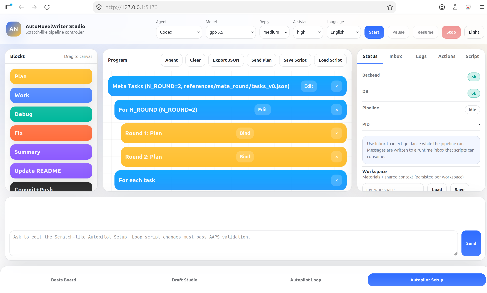

[English](README.md) · [العربية](i18n/README.ar.md) · [Español](i18n/README.es.md) · [Français](i18n/README.fr.md) · [日本語](i18n/README.ja.md) · [한국어](i18n/README.ko.md) · [Tiếng Việt](i18n/README.vi.md) · [中文 (简体)](i18n/README.zh-Hans.md) · [中文（繁體）](i18n/README.zh-Hant.md) · [Deutsch](i18n/README.de.md) · [Русский](i18n/README.ru.md)

[](https://github.com/lachlanchen/lachlanchen/blob/main/figs/banner.png)

# AutoAppDev 🚀


---

Reusable scripts + guides for building apps step-by-step from screenshots/markdown with Codex as a non-interactive tool.

> 🎯 **Mission:** Make app-development pipelines deterministic, resumable, and artifact-driven.
>
> 🧩 **Design principle:** Plan -> Work -> Verify -> Summary -> Commit/Push.

---

### 🎛️ Project Signals

| Signal               | Current Direction                                       |
| -------------------- | ------------------------------------------------------- |
| Runtime model        | Tornado backend + static PWA controller                 |
| Pipeline execution   | Deterministic and resumable (`start/pause/resume/stop`) |
| Persistence strategy | PostgreSQL-first with compatibility fallback behavior   |
| Documentation flow   | Canonical root README + automated `i18n/` variants      |

### 🔗 Quick Navigation

| Need                         | Go to                                                |
| ---------------------------- | ---------------------------------------------------- |
| First local run              | [⚡ Quick Start](#-quick-start)                      |
| Env and required variables   | [⚙️ Configuration](#-configuration)                  |
| API surface                  | [📡 API Snapshot](#-api-snapshot)                    |
| Runtime/debug playbooks      | [🧭 Operational Runbooks](#-operational-runbooks)    |
| README/i18n generation rules | [🌐 README & i18n Workflow](#-readme--i18n-workflow) |
| Troubleshooting matrix       | [🔧 Troubleshooting](#-troubleshooting)              |

<!-- AUTOAPPDEV:STATUS:BEGIN -->

## Self-Dev Status (Auto-Updated)

- Updated: 2026-02-16T00:27:20Z
- Phase commit: `Selfdev: 52 pwa_action_palette_dynamic_and_editable_blocks summary`
- Progress: 51 / 55 tasks done
- Codex session: `019c6056-f33a-7f31-b08f-0ca40c365351`
- Philosophy: Plan -> Work -> Verify -> Summary -> Commit/Push (linear, resumable)

This section is updated by `scripts/auto-autoappdev-development.sh`.
Do not edit content between the markers.

<!-- AUTOAPPDEV:STATUS:END -->

## 🗂️ Table of Contents

- [🚀 Overview](#-overview)
- [🧭 Repository Snapshot](#-repository-snapshot)
- [🧭 Philosophy](#-philosophy)
- [✨ Features](#-features)
- [📌 At A Glance](#-at-a-glance)
- [🖼️ Demos](#-demos)
- [🏗️ Architecture](#-architecture)
- [📚 Contents](#-contents)
- [🗂️ Project Structure](#-project-structure)
- [✅ Prerequisites](#-prerequisites)
- [🧩 Compatibility & Assumptions](#-compatibility--assumptions)
- [🛠️ Installation](#-installation)
- [⚡ Quick Start](#-quick-start)
- [⚙️ Configuration](#-configuration)
- [▶️ Usage](#-usage)
- [🧭 Operational Runbooks](#-operational-runbooks)
- [📡 API Snapshot](#-api-snapshot)
- [🧪 Examples](#-examples)
- [🧱 Development Notes](#-development-notes)
- [🔐 Safety Notes](#-safety-notes)
- [🔧 Troubleshooting](#-troubleshooting)
- [🌐 README & i18n Workflow](#-readme--i18n-workflow)
- [📘 Readme Generation Context](#-readme-generation-context)
- [❓ FAQ](#-faq)
- [🗺️ Roadmap](#-roadmap)
- [🤝 Contributing](#-contributing)
- [❤️ Support](#-support)
- [📄 License](#-license)

## 🧭 Repository Snapshot

| Focus         | Current setup                                           |
| ------------- | ------------------------------------------------------- |
| Core loop     | Plan → Work → Debug → Fix → Summary → Commit/Push       |
| Runtime model | Tornado backend + static PWA controller                 |
| State machine | `start` / `pause` / `resume` / `stop`                   |
| Persistence   | PostgreSQL-first with JSON fallback compatibility       |
| Documentation | Canonical `README.md` plus multilingual `i18n/` outputs |

## 🚀 Overview

AutoAppDev is a controller project for long-running, resumable app-development pipelines. It combines:

1. A Tornado backend API with PostgreSQL-backed persistence (plus local JSON fallback behavior in storage code).
2. A Scratch-like static PWA controller UI.
3. Scripts and docs for pipeline authoring, deterministic code generation, self-development loops, and README automation.

The project is optimized for predictable agent execution with strict sequencing and artifact-oriented workflow history.

### 🎨 Why this repo exists

| Theme               | What it means in practice                                                          |
| ------------------- | ---------------------------------------------------------------------------------- |
| Determinism         | Canonical pipeline IR + parser/import/codegen workflows designed for repeatability |
| Resumability        | Explicit lifecycle state machine (`start/pause/resume/stop`) for long-running runs |
| Operability         | Runtime logs, inbox/outbox channels, and script-driven verification loops          |
| Documentation-first | Contracts/specs/examples live in `docs/`, with automated multilingual README flow  |

## 🧭 Philosophy

AutoAppDev treats agents as tools and keeps work stable via a strict, resumable loop:

1. Plan
2. Implement
3. Debug/verify (with timeouts)
4. Fix
5. Summarize + log
6. Commit + push

The controller app aims to embody the same concepts as Scratch-like blocks/actions (including a common `update_readme` action) so each workspace stays current and reproducible.

### 🔁 Lifecycle state intent

| State transition | Operational intent                                        |
| ---------------- | --------------------------------------------------------- |
| `start`          | Begin a pipeline from stopped/ready state                 |
| `pause`          | Halt long-running execution safely without losing context |
| `resume`         | Continue from saved runtime state/artifacts               |
| `stop`           | End execution and return to a non-running state           |

## ✨ Features

- Resumable pipeline lifecycle control: start, pause, resume, stop.
- Script library APIs for AAPS pipeline scripts (`.aaps`) and canonical IR (`autoappdev_ir` v1).
- Deterministic parser/import pipeline:
  - Parse formatted AAPS scripts.
  - Import annotated shell via `# AAPS:` comments.
  - Optional Codex-assisted parse fallback (`AUTOAPPDEV_ENABLE_LLM_PARSE=1`).
- Action registry with built-ins + editable/custom actions (clone/edit flow for readonly built-ins).
- Scratch-like PWA blocks and runtime-loaded action palette (`GET /api/actions`).
- Runtime messaging channels:
  - Inbox (`/api/inbox`) for operator -> pipeline guidance.
  - Outbox (`/api/outbox`) including file-queue ingestion from `runtime/outbox`.
- Incremental log streaming from backend and pipeline logs (`/api/logs`, `/api/logs/tail`).
- Deterministic runner codegen from canonical IR (`scripts/pipeline_codegen/generate_runner_from_ir.py`).
- Self-dev driver for iterative repository evolution (`scripts/auto-autoappdev-development.sh`).
- README automation pipeline with multilingual generation scaffolding under `i18n/`.

## 📌 At A Glance

| Area           | Details                                                              |
| -------------- | -------------------------------------------------------------------- |
| Core runtime   | Tornado backend + static PWA frontend                                |
| Persistence    | PostgreSQL-first with compatibility behavior in `backend/storage.py` |
| Pipeline model | Canonical IR (`autoappdev_ir` v1) and AAPS script format             |
| Control flow   | Start / Pause / Resume / Stop lifecycle                              |
| Dev mode       | Resumable self-dev loop + deterministic script/codegen workflows     |
| README/i18n    | Automated README pipeline with `i18n/` scaffolding                   |

## 🖼️ Demos

### AutoNovelWriter Autopilot Setup

AutoNovelWriter reuses AutoAppDev's Scratch-like pipeline ideas for a novel-writing studio: blocks on the left, a nested Autopilot Setup canvas in the center, live status/actions on the right, and a chat input below for guided updates.



## 🏗️ Architecture

```text
Operator / Developer
        |
        v
   PWA (static files, pwa/)
        |
        | HTTP JSON API
        v
Tornado backend (backend/app.py)
        |
        +--> Postgres (DATABASE_URL)
        +--> runtime/ (logs, outbox, llm_parse artifacts)
        +--> scripts/ (pipeline runner + codegen helpers)
```

### Backend responsibilities

- Expose controller APIs for scripts, actions, plan, pipeline lifecycle, logs, inbox/outbox, workspace config.
- Validate and persist pipeline script assets.
- Coordinate pipeline execution state and status transitions.
- Provide deterministic fallback behavior when DB pool is unavailable.

### Frontend responsibilities

- Render Scratch-like block UI and pipeline editing flow.
- Load action palette dynamically from backend registry.
- Drive lifecycle controls and monitor status/logs/messages.

## 📚 Contents

Reference map for the most commonly used docs, scripts, and examples:

- `docs/auto-development-guide.md`: Bilingual (EN/ZH) philosophy and requirements for a long-running, resumable auto-development agent.
- `docs/ORDERING_RATIONALE.md`: Example rationale for sequencing screenshot-driven steps.
- `docs/controller-mvp-scope.md`: Controller MVP scope (screens + minimal APIs).
- `docs/end-to-end-demo-checklist.md`: Deterministic manual end-to-end demo checklist (backend + PWA happy path).
- `docs/env.md`: Environment variables (`.env`) conventions.
- `docs/api-contracts.md`: API request/response contracts for the controller.
- `docs/pipeline-formatted-script-spec.md`: Standard pipeline script format (AAPS) and canonical IR schema (TASK -> STEP -> ACTION).
- `docs/pipeline-runner-codegen.md`: Deterministic generator for runnable bash pipeline runners from canonical IR.
- `docs/common-actions.md`: Common action contracts/specs (includes `update_readme`).
- `docs/workspace-layout.md`: Standard workspace folders + contracts (`materials/interactions/outputs/docs/references/scripts/tools/logs/auto-apps`).
- `scripts/run_autoappdev_tmux.sh`: Start the AutoAppDev app (backend + PWA) in tmux.
- `scripts/run_autoappdev_selfdev_tmux.sh`: Start the AutoAppDev self-dev driver in tmux.
- `scripts/app-auto-development.sh`: Linear pipeline driver (`plan -> backend -> PWA -> Android -> iOS -> review -> summary`) with resume/state support.
- `scripts/generate_screenshot_docs.sh`: Screenshot -> markdown description generator (Codex-driven).
- `scripts/setup_autoappdev_env.sh`: Main conda env bootstrap script for local runs.
- `scripts/setup_backend_env.sh`: Backend env helper script.
- `examples/ralph-wiggum-example.sh`: Example Codex CLI automation helper.

## 🗂️ Project Structure

```text
AutoAppDev/
├── README.md
├── .env.example
├── .github/
│   └── FUNDING.yml
├── backend/
│   ├── app.py
│   ├── storage.py
│   ├── schema.sql
│   ├── apply_schema.py
│   ├── db_smoketest.py
│   ├── action_registry.py
│   ├── builtin_actions.py
│   ├── update_readme_action.py
│   ├── pipeline_parser.py
│   ├── pipeline_shell_import.py
│   ├── llm_assisted_parse.py
│   ├── workspace_config.py
│   ├── requirements.txt
│   └── README.md
├── pwa/
│   ├── index.html
│   ├── app.js
│   ├── i18n.js
│   ├── api-client.js
│   ├── styles.css
│   ├── service-worker.js
│   ├── manifest.json
│   └── README.md
├── docs/
├── scripts/
│   └── pipeline_codegen/
├── prompt_tools/
├── examples/
├── references/
├── i18n/
└── .auto-readme-work/
```

## ✅ Prerequisites

- OS with `bash`.
- Python `3.11+`.
- Conda (`conda`) for the provided setup scripts.
- `tmux` for one-command backend+PWA or self-dev sessions.
- PostgreSQL reachable by `DATABASE_URL`.
- Optional: `codex` CLI for Codex-powered flows (self-dev, parse-llm fallback, auto-readme pipeline).

Quick requirement matrix:

| Component      | Required               | Purpose                                           |
| -------------- | ---------------------- | ------------------------------------------------- |
| `bash`         | Yes                    | Script execution                                  |
| Python `3.11+` | Yes                    | Backend + codegen tooling                         |
| Conda          | Yes (recommended flow) | Environment bootstrap scripts                     |
| PostgreSQL     | Yes (preferred mode)   | Primary persistence via `DATABASE_URL`            |
| `tmux`         | Recommended            | Managed backend/PWA and self-dev sessions         |
| `codex` CLI    | Optional               | LLM-assisted parse and README/self-dev automation |

## 🧩 Compatibility & Assumptions

| Topic             | Current expectation                                                              |
| ----------------- | -------------------------------------------------------------------------------- |
| Local OS          | Linux/macOS shells are the primary target (`bash` scripts)                       |
| Python runtime    | `3.11` (managed by `scripts/setup_autoappdev_env.sh`)                            |
| Persistence mode  | PostgreSQL is preferred and treated as canonical                                 |
| Fallback behavior | `backend/storage.py` includes JSON compatibility fallback for degraded scenarios |
| Network model     | Localhost split-port development (backend + static PWA)                          |
| Agent tooling     | `codex` CLI is optional unless using LLM-assisted parse or self-dev automation   |

Assumptions used in this README:

- You run commands from repository root unless a section says otherwise.
- `.env` is configured before starting backend services.
- `conda` and `tmux` are available for the recommended one-command workflows.

## 🛠️ Installation

### 1) Clone and enter repo

```bash
git clone git@github.com:lachlanchen/AutoAppDev.git
cd AutoAppDev
```

### 2) Configure environment

```bash
cp .env.example .env
```

Edit `.env` and set at least:

- `SECRET_KEY`
- `DATABASE_URL`
- `AUTOAPPDEV_HOST` and `AUTOAPPDEV_PORT` (or `PORT`)

### 3) Create/update backend environment

```bash
./scripts/setup_autoappdev_env.sh
```

### 4) Apply database schema

```bash
conda run -n autoappdev python -m backend.apply_schema
```

### 5) Optional: database smoke test

```bash
conda run -n autoappdev python -m backend.db_smoketest
```

## ⚡ Quick Start

```bash
# from repo root
cp .env.example .env
./scripts/setup_autoappdev_env.sh
conda run -n autoappdev python -m backend.apply_schema
./scripts/run_autoappdev_tmux.sh --restart
```

Then open:

- PWA: `http://127.0.0.1:5173/`
- Backend API base: `http://127.0.0.1:8788`
- Health check: `http://127.0.0.1:8788/api/health`

Smoke-check with one command:

```bash
curl -sS http://127.0.0.1:8788/api/health | python3 -m json.tool
```

Quick endpoint map:

| Surface         | URL                                |
| --------------- | ---------------------------------- |
| PWA UI          | `http://127.0.0.1:5173/`           |
| Backend API     | `http://127.0.0.1:8788`            |
| Health endpoint | `http://127.0.0.1:8788/api/health` |

## ⚙️ Configuration

Primary file: `.env` (see `docs/env.md` and `.env.example`).

### Important variables

| Variable                                                                                  | Purpose                                    |
| ----------------------------------------------------------------------------------------- | ------------------------------------------ |
| `SECRET_KEY`                                                                              | Required by convention                     |
| `AUTOAPPDEV_HOST`, `AUTOAPPDEV_PORT`, `PORT`                                              | Backend bind settings                      |
| `DATABASE_URL`                                                                            | PostgreSQL DSN (preferred)                 |
| `AUTOAPPDEV_RUNTIME_DIR`                                                                  | Override runtime dir (default `./runtime`) |
| `AUTOAPPDEV_PIPELINE_CWD`, `AUTOAPPDEV_PIPELINE_SCRIPT`                                   | Default pipeline run target                |
| `AUTOAPPDEV_ENABLE_LLM_PARSE=1`                                                           | Enable `/api/scripts/parse-llm`            |
| `AUTOAPPDEV_CODEX_MODEL`, `AUTOAPPDEV_CODEX_REASONING`, `AUTOAPPDEV_CODEX_SKIP_GIT_CHECK` | Codex defaults for actions/endpoints       |
| `AI_API_BASE_URL`, `AI_API_KEY`                                                           | Reserved for future integrations           |

Validate `.env` quickly:

```bash
bash -lc 'set -euo pipefail; test -f .env; set -a; source .env; set +a; \
python3 - <<"PY"\
import os, sys\
req = ["SECRET_KEY", "DATABASE_URL"]\
missing = [k for k in req if not os.getenv(k)]\
port_ok = bool(os.getenv("AUTOAPPDEV_PORT") or os.getenv("PORT"))\
if not port_ok: missing.append("AUTOAPPDEV_PORT or PORT")\
if missing:\
  print("Missing env:", ", ".join(missing))\
  sys.exit(1)\
print("OK: env looks set")\
PY'
```

## ▶️ Usage

| Mode                              | Command                                                  | Notes                                                         |
| --------------------------------- | -------------------------------------------------------- | ------------------------------------------------------------- |
| Start backend + PWA (recommended) | `./scripts/run_autoappdev_tmux.sh --restart`             | Backend `http://127.0.0.1:8788`, PWA `http://127.0.0.1:5173/` |
| Start backend only                | `conda run -n autoappdev python -m backend.app`          | Uses `.env` bind + DB settings                                |
| Start PWA static server only      | `cd pwa && python3 -m http.server 5173 --bind 127.0.0.1` | Useful for frontend-only checks                               |
| Run self-dev driver in tmux       | `./scripts/run_autoappdev_selfdev_tmux.sh --restart`     | Resumable self-development loop                               |

### Common script options

- `./scripts/run_autoappdev_tmux.sh --help`
- `./scripts/run_autoappdev_tmux.sh --backend-port 8790 --pwa-port 5174`
- `./scripts/run_autoappdev_tmux.sh --detached`
- `./scripts/run_autoappdev_selfdev_tmux.sh --help`
- `./scripts/run_autoappdev_selfdev_tmux.sh --start-at 14 --reasoning xhigh`

### Parse and store scripts

- Parse AAPS via API: `POST /api/scripts/parse`
- Import annotated shell: `POST /api/scripts/import-shell`
- Optional LLM parse: `POST /api/scripts/parse-llm` (requires `AUTOAPPDEV_ENABLE_LLM_PARSE=1`)

### Pipeline control APIs

- `GET /api/pipeline`
- `GET /api/pipeline/status`
- `POST /api/pipeline/start`
- `POST /api/pipeline/pause`
- `POST /api/pipeline/resume`
- `POST /api/pipeline/stop`

### Other frequently used APIs

- Health/version/config: `/api/health`, `/api/version`, `/api/config`
- Plan/scripts: `/api/plan`, `/api/scripts`, `/api/scripts/<id>`
- Actions: `/api/actions`, `/api/actions/<id>`, `/api/actions/<id>/clone`, `/api/actions/update-readme`
- Messaging: `/api/chat`, `/api/inbox`, `/api/outbox`
- Logs: `/api/logs`, `/api/logs/tail`

See `docs/api-contracts.md` for request/response shapes.

## 🧭 Operational Runbooks

### Runbook: bring up the full local stack

```bash
cp .env.example .env
./scripts/setup_autoappdev_env.sh
conda run -n autoappdev python -m backend.apply_schema
./scripts/run_autoappdev_tmux.sh --restart
```

Validation checkpoints:

- `curl -sS http://127.0.0.1:8788/api/health | python3 -m json.tool`
- Open `http://127.0.0.1:5173/` and confirm the UI can load `/api/config`.
- Optional: open `/api/version` and verify expected backend metadata is returned.

### Runbook: backend-only debugging

```bash
conda run -n autoappdev python -m backend.app
curl -sS http://127.0.0.1:8788/api/version
curl -sS http://127.0.0.1:8788/api/pipeline/status | python3 -m json.tool
```

### Runbook: deterministic codegen smoke

```bash
python3 scripts/pipeline_codegen/generate_runner_from_ir.py \
  --in examples/pipeline_ir_codegen_demo_v0.json \
  --out /tmp/autoappdev_runner.sh

bash -n /tmp/autoappdev_runner.sh
scripts/pipeline_codegen/smoke_codegen.sh
scripts/pipeline_codegen/smoke_placeholders.sh
scripts/pipeline_codegen/smoke_conditional_steps.sh
scripts/pipeline_codegen/smoke_meta_round_v0.sh
```

## 📡 API Snapshot

Core API groups at a glance:

| Category              | Endpoints                                                                                                                                                       |
| --------------------- | --------------------------------------------------------------------------------------------------------------------------------------------------------------- |
| Health + runtime info | `GET /api/health`, `GET /api/version`, `GET /api/config`, `POST /api/config`                                                                                    |
| Plan model            | `GET /api/plan`, `POST /api/plan`                                                                                                                               |
| Scripts               | `GET/POST /api/scripts`, `GET/PUT/DELETE /api/scripts/<id>`, `POST /api/scripts/parse`, `POST /api/scripts/import-shell`, `POST /api/scripts/parse-llm`         |
| Action registry       | `GET/POST /api/actions`, `GET/PUT/DELETE /api/actions/<id>`, `POST /api/actions/<id>/clone`, `POST /api/actions/update-readme`                                  |
| Pipeline runtime      | `GET /api/pipeline`, `GET /api/pipeline/status`, `POST /api/pipeline/start`, `POST /api/pipeline/pause`, `POST /api/pipeline/resume`, `POST /api/pipeline/stop` |
| Messaging + logs      | `GET/POST /api/chat`, `GET/POST /api/inbox`, `GET/POST /api/outbox`, `GET/POST /api/logs`, `GET /api/logs/tail`                                                 |
| Workspace settings    | `GET/POST /api/workspaces/<name>/config`                                                                                                                        |

## 🧪 Examples

### AAPS example

```text
AUTOAPPDEV_PIPELINE 1

TASK  {"id":"t1","title":"Happy path demo"}
STEP  {"id":"s1","title":"Plan","block":"plan"}
ACTION {"id":"a1","kind":"note","params":{"text":"Read context and outline steps."}}
```

Full examples:

- `examples/pipeline_formatted_script_v1.aaps`
- `examples/pipeline_ir_v1.json`
- `examples/pipeline_shell_annotated_v0.sh`
- `examples/pipeline_ir_codegen_demo_v0.json`

### Deterministic runner generation

```bash
python3 scripts/pipeline_codegen/generate_runner_from_ir.py \
  --in examples/pipeline_ir_codegen_demo_v0.json \
  --out /tmp/autoappdev_runner.sh

bash -n /tmp/autoappdev_runner.sh
scripts/pipeline_codegen/smoke_codegen.sh
```

### Deterministic demo pipeline

```bash
export AUTOAPPDEV_PIPELINE_SCRIPT=scripts/pipeline_demo.sh
conda run -n autoappdev python -m backend.app
```

Then use the PWA Start/Pause/Resume/Stop controls and inspect `/api/logs`.

### Import from annotated shell

```bash
curl -sS -X POST http://127.0.0.1:8788/api/scripts/import-shell \
  -H 'Content-Type: application/json' \
  -d @- <<'JSON'
{
  "shell_text": "#!/usr/bin/env bash\n# AAPS: AUTOAPPDEV_PIPELINE 1\n# AAPS:\n# AAPS: TASK {\"id\":\"t1\",\"title\":\"Demo\"}\n# AAPS: STEP {\"id\":\"s1\",\"title\":\"Plan\",\"block\":\"plan\"}\n# AAPS: ACTION {\"id\":\"a1\",\"kind\":\"noop\"}\n"
}
JSON
```

## 🧱 Development Notes

- The backend is Tornado-based and designed for local dev ergonomics (including permissive CORS for localhost split ports).
- Storage is PostgreSQL-first with compatibility behavior in `backend/storage.py`.
- PWA block keys and script `STEP.block` values are intentionally aligned (`plan`, `work`, `debug`, `fix`, `summary`, `commit_push`).
- Built-in actions are readonly; clone before editing.
- `update_readme` action is path-safety constrained to workspace README targets under `auto-apps/<workspace>/README.md`.
- There are historical path/name references in some docs/scripts (`HeyCyan`, `LightMind`) inherited from project evolution. Current repo canonical path is this repository root.
- The root `i18n/` directory exists. Language README files are expected there in multilingual runs.

### Working model and state files

- Runtime defaults to `./runtime` unless overridden by `AUTOAPPDEV_RUNTIME_DIR`.
- Self-dev automation state/history is tracked under `references/selfdev/`.
- README pipeline artifacts are recorded under `.auto-readme-work/<timestamp>/`.

### Testing posture (current)

- Repository includes smoke checks and deterministic demo scripts.
- A full top-level automated test suite/CI manifest is not currently defined in root metadata.
- Assumption: validation is primarily script-driven for now (`scripts/pipeline_codegen/smoke_*.sh`, `backend.db_smoketest`, end-to-end checklist).

## 🔐 Safety Notes

- `update_readme` action is intentionally constrained to workspace README targets (`auto-apps/<workspace>/README.md`) with path traversal protections.
- Action registry validation enforces normalized action spec fields and bounded values for supported reasoning levels.
- Repository scripts assume trusted local execution; review script bodies before running in shared or production-adjacent environments.
- `.env` may hold sensitive values (`DATABASE_URL`, API keys). Keep `.env` uncommitted and use environment-specific secret management outside local dev.

## 🔧 Troubleshooting

| Symptom                                     | What to check                                                                                                                                                                  |
| ------------------------------------------- | ------------------------------------------------------------------------------------------------------------------------------------------------------------------------------ |
| `tmux not found`                            | Install `tmux` or run backend/PWA manually.                                                                                                                                    |
| Backend fails on startup due to missing env | Recheck `.env` against `.env.example` and `docs/env.md`.                                                                                                                       |
| Database errors (connection/auth/schema)    | Verify `DATABASE_URL`; re-run `conda run -n autoappdev python -m backend.apply_schema`; optional connectivity check: `conda run -n autoappdev python -m backend.db_smoketest`. |
| PWA loads but cannot call API               | Ensure backend is listening on expected host/port; regenerate `pwa/config.local.js` by re-running `./scripts/run_autoappdev_tmux.sh`.                                          |
| Pipeline Start returns invalid transition   | Check current pipeline status first; start from `stopped` state.                                                                                                               |
| No log updates in UI                        | Confirm `runtime/logs/pipeline.log` is being written; use `/api/logs` and `/api/logs/tail` directly to isolate UI vs backend issues.                                           |
| LLM parse endpoint returns disabled         | Set `AUTOAPPDEV_ENABLE_LLM_PARSE=1` and restart backend.                                                                                                                       |
| `conda run -n autoappdev ...` fails         | Re-run `./scripts/setup_autoappdev_env.sh`; confirm conda env `autoappdev` exists (`conda env list`).                                                                          |
| Wrong API target in frontend                | Confirm `pwa/config.local.js` exists and points to active backend host/port.                                                                                                   |

For a deterministic manual verification path, use `docs/end-to-end-demo-checklist.md`.

## 🌐 README & i18n Workflow

- Root README is the canonical source used by the README automation pipeline.
- Multilingual variants are expected under `i18n/`.
- i18n directory status: ✅ present in this repository.
- Current language set in this repository:
  - `i18n/README.ar.md`
  - `i18n/README.de.md`
  - `i18n/README.es.md`
  - `i18n/README.fr.md`
  - `i18n/README.ja.md`
  - `i18n/README.ko.md`
  - `i18n/README.ru.md`
  - `i18n/README.vi.md`
  - `i18n/README.zh-Hans.md`
  - `i18n/README.zh-Hant.md`
- Language navigation should stay as a single line at the top of each README variant (no duplicated language bars).
- README pipeline entrypoint: `prompt_tools/auto-readme-pipeline.sh`.

### i18n generation constraints (strict)

- Always process multilingual generation when updating canonical README content.
- Generate/update language files one-by-one (sequentially), not in bulk ambiguous batches.
- Keep exactly one language-options navigation line at the top of each variant.
- Do not duplicate language bars within the same file.
- Preserve canonical command snippets, links, API paths, and badge intent across translations.

Suggested one-by-one generation order:

1. `i18n/README.ar.md`
2. `i18n/README.de.md`
3. `i18n/README.es.md`
4. `i18n/README.fr.md`
5. `i18n/README.ja.md`
6. `i18n/README.ko.md`
7. `i18n/README.ru.md`
8. `i18n/README.vi.md`
9. `i18n/README.zh-Hans.md`
10. `i18n/README.zh-Hant.md`

Language coverage table:

| Language | File                |
| -------- | ------------------- |
| Arabic   | `i18n/README.ar.md` |

Observed workspace note:

- `i18n/README.zh-Hant.md.tmp` may appear as a temporary translation artifact; keep final canonical files as `README.<lang>.md`.

## 📘 Readme Generation Context

- Pipeline run timestamp: `20260301_095119`
- Trigger: `./README.md` first complete draft generation (canonical-base incremental update)
- Input user prompt: `Use current README as canonical base. No reduction: only increment and improve. Preserve existing content, links, badges, commands, and details. Always process multilingual generation (do not skip): ensure i18n exists and generate/update language files one-by-one with a single language-options line at the top and no duplicates.`
- Goal: generate a complete, beautiful README draft with required sections and support information
- Source snapshot used:
  - `./.auto-readme-work/20260301_095119/pipeline-context.md`
  - `./.auto-readme-work/20260301_095119/repo-structure-analysis.md`
- This file was generated from repository contents and preserved as a canonical draft entry point.

## ❓ FAQ

### Is PostgreSQL mandatory?

Preferred and expected for normal operation. The storage layer contains fallback compatibility behavior, but production-like usage should assume PostgreSQL is available via `DATABASE_URL`.

### Why both `AUTOAPPDEV_PORT` and `PORT`?

`AUTOAPPDEV_PORT` is project-specific. `PORT` exists as a deployment-friendly alias. Keep them aligned unless you intentionally override behavior in your launch path.

### Where should I start if I only want to inspect APIs?

Run backend-only (`conda run -n autoappdev python -m backend.app`) and use `/api/health`, `/api/version`, `/api/config`, then script/action endpoints listed in `docs/api-contracts.md`.

### Are multilingual READMEs generated automatically?

Yes. The repository includes `prompt_tools/auto-readme-pipeline.sh`, and language variants are maintained under `i18n/` with one language-navigation line at the top of each variant.

## 🗺️ Roadmap

- Complete remaining self-dev tasks beyond current `51 / 55` status.
- Expand workspace/materials/context tooling and stronger safe-path contracts.
- Continue improving action palette UX and editable action workflows.
- Deepen multilingual README/UI support across `i18n/` and runtime language switching.
- Strengthen smoke/integration checks and CI coverage (currently script-driven smoke checks are present; no full CI manifest is documented at root).
- Continue hardening parser/import/codegen determinism around AAPS v1 and canonical IR.

## 🤝 Contributing

Contributions are welcome via issues and pull requests.

Suggested workflow:

1. Fork and create a feature branch.
2. Keep changes focused and reproducible.
3. Prefer deterministic scripts/tests where possible.
4. Update docs when behavior/contracts change (`docs/*`, API contracts, examples).
5. Open a PR with context, validation steps, and any runtime assumptions.

Repository remotes currently include:

- `origin`: `git@github.com:lachlanchen/AutoAppDev.git`
- Additional remotes may be present in local clones for related repositories (example found in this workspace: `novel`).

---

## ❤️ Support

| Donate                                                                                                                                                                                                                                                                                                                                                     | PayPal                                                                                                                                                                                                                                                                                                                                                          | Stripe                                                                                                                                                                                                                                                                                                                                                              |
| ---------------------------------------------------------------------------------------------------------------------------------------------------------------------------------------------------------------------------------------------------------------------------------------------------------------------------------------------------------- | --------------------------------------------------------------------------------------------------------------------------------------------------------------------------------------------------------------------------------------------------------------------------------------------------------------------------------------------------------------- | ------------------------------------------------------------------------------------------------------------------------------------------------------------------------------------------------------------------------------------------------------------------------------------------------------------------------------------------------------------------- |
| [](https://chat.lazying.art/donate) | [](https://paypal.me/RongzhouChen) | [](https://buy.stripe.com/aFadR8gIaflgfQV6T4fw400) |

## 📄 License


No root `LICENSE` file was detected in this repository snapshot.

Assumption note:

- Until a license file is added, treat usage/redistribution terms as unspecified and confirm with the maintainer.
